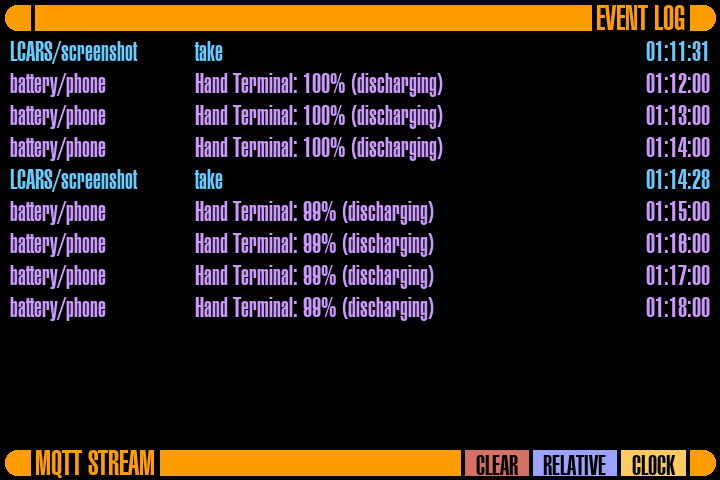
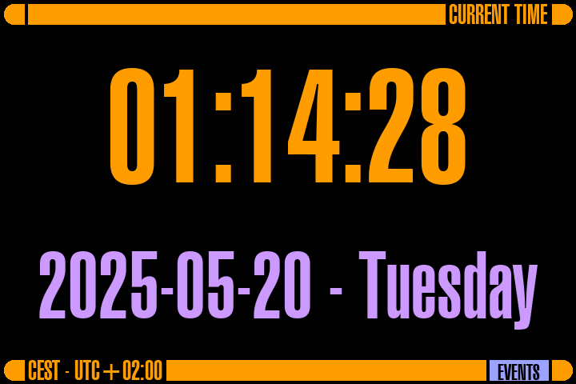

#+title: MQTT Framebuffer panel for Raspberry Pi 2

Something to display MQTT messages and other stuff on a 3.5' TFT screen hooked up to an old Raspberry Pi 2.

Initial version made by ChatGPT o3, because who writes their own code these days anyway.

Continued with help of Gemini 2.5 Pro via Aider.

Also supports actual touch inputs and has a clock mode now.

Next planned features:
- Sounds
- A mode to control a non-wifi A/C unit, so I can use it instead of the manufacturer's boring wall panel (and also control it from Home Assistant)

* Virtual panel (development harness)

The panel can run entirely without the Raspberry Pi: =virtual/= contains a
harness that executes the *unmodified* production code against fake
framebuffer/MQTT/touch modules, renders to a live browser viewer (click =
touch), and provides synthetic MQTT controls including broker-chaos buttons
that reproduce the 2026 "silently deaf after broker restart" incident.

: pip install -r virtual/requirements.txt
: python3 virtual/run_virtual.py     # then open http://localhost:8724

Headless scenario runs, golden-image comparison, device-side replay for
fidelity checks, and browser-replayable committed recordings (viewable via
GitHub Pages) are included — see =virtual/README.md=.

There is also a fully client-side variant: =virtual/web/panel.html= runs the
same unmodified panel code entirely in the browser via Pyodide (works
straight from GitHub Pages, no install at all).

* MQTT robustness & operations

The MQTT layer is hardened against broker restarts. Previously, a Mosquitto restart that wiped sessions would leave the panel silently connected-but-subscribed-to-nothing (paho's auto-reconnect does not replay subscriptions). Now:

- Subscriptions are (re)established in the =on_connect= callback, i.e. on /every/ (re)connect; reconnects are retried with 1-60s backoff. Connects, disconnects, and subscription confirmations are all logged.
- *Availability*: a retained MQTT Last Will of =offline= is registered on the topic from =MQTT_AVAILABILITY_TOPIC= (default =lcars/alert-panel/availability=), and retained =online= is published only after /all/ subscriptions are confirmed. =online= therefore means "connected /and/ subscribed" — suitable for a Home Assistant MQTT binary sensor plus an alert automation.
- *Mode state*: the current display mode (=events= / =clock=) is published retained to =MQTT_MODE_TOPIC= (default =lcars/alert-panel/mode=) on every mode change (MQTT command or touch) and after every (re)connect. State reporting only; the panel never acts on this topic.
- *Remote restart*: publish anything (non-retained; retained restart commands are ignored to prevent restart loops) to =<MQTT_CONTROL_TOPIC_PREFIX>restart= and the panel cleans up (framebuffer, touch device), exits nonzero, and systemd restarts it.
- *systemd watchdog*: the service unit now uses =Type=notify= with =WatchdogSec=30=, =Restart=always= and =RestartSec=2=. The panel implements =sd_notify= natively (raw datagram to =NOTIFY_SOCKET=, no extra dependency) — =READY=1= after startup, =WATCHDOG=1= from the main loop — and is a no-op when run standalone outside systemd.

New environment variables (see =mqtt_alert_panel.env.example=): =MQTT_AVAILABILITY_TOPIC=, =MQTT_MODE_TOPIC=, =MQTT_CLIENT_ID=. A =<hostname>= placeholder in any of them is replaced with the device hostname.

When updating an existing deployment, re-copy =mqtt-alert.service.example= over the installed unit and run =sudo systemctl daemon-reload= — the =Type=notify= + watchdog changes only take effect with the new unit file.
